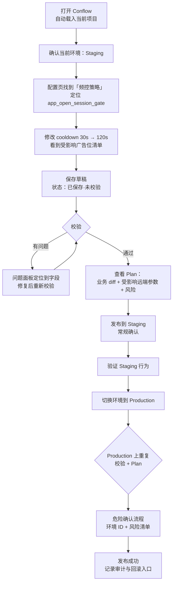

# PM 主路径：修改频控并发布到 Production

> 验收基准（Spec 012）：PM 能在不理解 Pack / Adapter 术语的情况下，说明如何完成这条路径。

## 场景

PM 收到反馈「开屏广告太频繁」，需要把开屏广告的冷却时间从 30 秒调到 120 秒，先在 Staging 验证，再发布到 Production。

## 端到端流程

## PM 视角的语言（不出现实现术语）

| 实现概念 | PM 看到的语言 |
|---|---|
| Pack / entity | 「配置」「广告位 / 频控策略 / 功能开关」 |
| draft / baseline / override | 「未发布的修改」「通用值 / 此环境的专属值」 |
| plan / compile | 「本次发布会改什么」 |
| provider / Firebase RC | 「线上配置」「发布目标」 |
| revision / ETag 冲突 | 「别处刚改过这份配置，请先查看最新内容」 |

## 主路径上的关键判定点

1. **改基线还是改环境覆盖**：cooldown 调整默认改基线（影响所有环境）；UI 必须在保存前让 PM 看见「影响 Staging + Production」的事实，并提供「只改当前环境」入口。
2. **校验不是发布**：保存、校验、发布是三个独立状态；PM 中断后回来能从状态徽标恢复认知。
3. **两次发布两次 Plan**：Staging 与 Production 各自有 Plan 与确认；Production 的确认是升级版（见 [05-production-release.md](05-production-release.md)）。

## 需要原型验证的问题

- 「受影响广告位清单」出现在频控编辑处，还是只在 Plan 页？
- Staging 验证完成后引导切到 Production 的入口是什么（首页提示 / 发布完成页 CTA / 无引导）？
- PM 中途关闭浏览器再打开，未发布修改的可见性是否足够。
