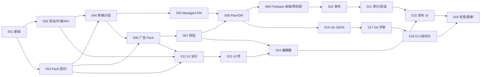

# 实现规格（Spec）

每份 Spec 是一个可独立实现、评审和验收的工作单元。实现前确认不与 Design / ADR 冲突；完成定义为：范围内验收全部通过、OpenAPI/文档/代码联动、`make check` 通过、状态改为“已实现”。

## 规格清单

| 编号 | 标题 | 依赖 | 状态 |
|---|---|---|---|
| [001](001-foundation.md) | Go CLI、本地服务与嵌入式 React 基础 | — | 已实现 |
| [002](002-project-environments-api.md) | 项目、环境与 API 基础 | 001 | 已实现 |
| [003](003-config-pack-contract.md) | Config Pack 契约与注册表 | 001 | 已实现 |
| [004](004-draft-layering.md) | 草稿与分层配置模型 | 002、003 | 已实现 |
| [005](005-managed-file-source.md) | Managed File 源适配器 | 004 | 已实现 |
| [006](006-mobile-ad-pack.md) | 移动广告配置包领域模型 | 003、004 | 已实现 |
| [007](007-validation-engine.md) | 校验、引用完整性与发布就绪度 | 006 | 已实现 |
| [008](008-plan-semantic-diff.md) | 构建计划、语义 Diff 与风险分析 | 005、007 | 已实现 |
| [009](009-firebase-read-validate.md) | Firebase 认证、拉取与预校验 | 002、005、008 | 已实现 |
| [010](010-firebase-publish.md) | Firebase 发布与并发保护 | 008、009 | 已实现 |
| [011](011-release-audit-rollback.md) | 发布审计、默认值下载与回滚 | 010 | 已实现 |
| [012](012-ui-design-prototype.md) | UI 设计探索与设计基线 | 002、003、006 | 已实现 |
| [013](013-ui-project-shell.md) | Web 应用壳、项目与环境管理 UI | 002、003、012 | 已实现 |
| [014](014-ui-domain-editor.md) | 业务配置编辑器 | 004、006、007、012、013 | 已实现 |
| [015](015-ui-plan-release.md) | 校验、Plan、发布与回滚 UI | 008–012、014 | 待实现 |
| [016](016-git-json-source.md) | Git JSON 源适配器与迁移 | 004、005、008 | 待实现 |
| [017](017-git-review-workflow.md) | Git 评审工作流与审阅产物 | 008、016 | 待实现 |
| [018](018-cli-automation.md) | CLI 能力对齐与自动化契约 | 007–011、016、017 | 待实现 |
| [019](019-release-update.md) | 跨平台发版、签名与更新 | 015、018 | 待实现 |

新建规格使用 [template.md](template.md)。

## 主依赖图

图中突出主路径，完整直接依赖以规格清单表为准。依赖表示实现前置，不要求里程碑完全串行。Spec 012 在广告领域合同稳定后即可开始，与 Firebase Provider 实现并行。

## 执行规则

- 一份 Spec 一个聚焦 PR；接口契约变化先改 `api/openapi.yaml`。
- UI Spec 消费新端点前，先合并 contract-only PR：对应后端 Spec、跨域 HTTP 语义、OpenAPI、示例、生成类型与 contract fixture 同步更新，不混入 Handler 或 React 实现。一个公开行为确实跨越多个 Spec 时可在同一合同 PR 收口，但实现仍按 Spec 分开交付。
- UI flows 中的服务端行为假设必须映射到已合并合同或 [`UI 假设与后端合同缺口`](../design/ui/contract-gaps.md)；未记录的假设先补合同再实现。
- 跨 Go golden tests、API tests 与 UI E2E 的业务场景使用同一份结构化 contract fixture；Markdown 和截图只作为人类可读说明。
- Worker 只拥有被分配 Spec 的文件范围；跨 Spec 变更先回到主控确认。
- review-only 任务只报告问题，不直接修改其他 Spec。
- Spec 与 ADR 冲突时停止实现，新增 ADR 或由维护者决策。
